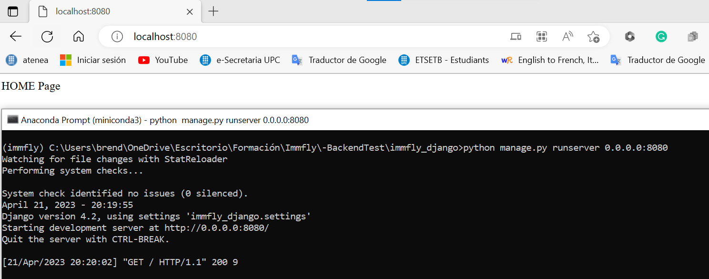
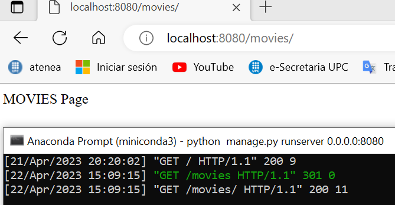
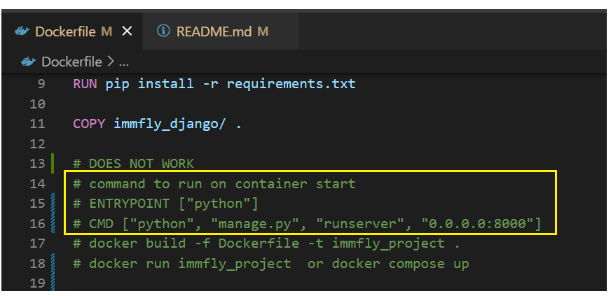
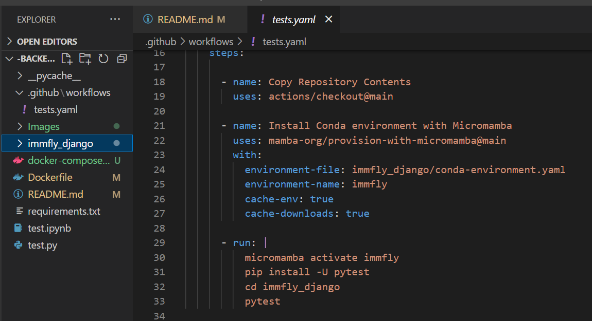
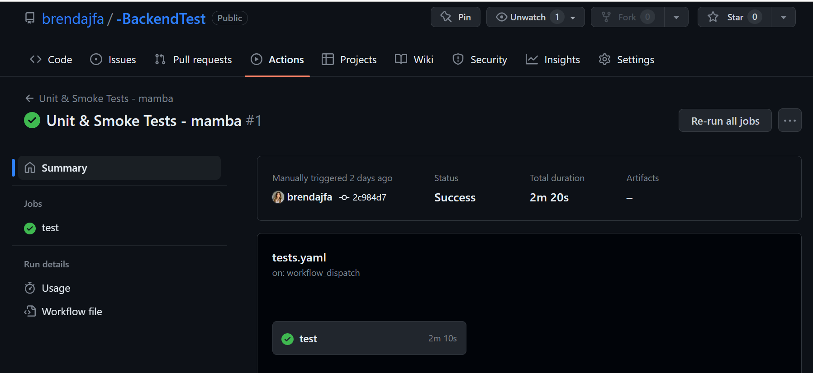

# -BackendTest

Table of Contents
=================

- [-BackendTest](#-backendtest)
- [Table of Contents](#table-of-contents)
  - [Requirements](#requirements)
  - [Create a Django project](#create-a-django-project)
  - [Execution procedure](#execution-procedure)
    - [Miniconda](#miniconda)
    - [Docker](#docker)
      - [To check if code has issues](#to-check-if-code-has-issues)
      - [Modify Django code](#modify-django-code)
  - [CI/CD with Pytest](#cicd-with-pytest)
  - [Calculate average rating](#calculate-average-rating)

---
## Requirements

<div align="justify">

The requirements we ask for this test are:

* Create a Django project to define an API
* Define models to represent the structure explained above
* Create a management command to efficiently calculate the ratings of every channel and export them in a csv file sorted by rating (i.e. the highest rated channels on top). The csv contains two columns: [channel title, average rating]
* Create endpoints to retrieve the channels, their subchannels and its contents
* Add unit tests to test the channel rating algorithm


Get bonus points for:
* Adding Groups to the channels. Considering that each channel can belong to multiple groups.
  
> Allow filtering by group on Channels API.
Note: Take into account that any channel’s groups set should be included in its parent’s group set

* High test coverage through unit tests
* Usage of docker to run the services
* Addition of type annotations (bonus for passing strict mypy type checks)
* Adding CI/CD (Gitlab CI is preferred, but you can use anything you want)

You can use any libraries, DBMS or tools you need to accomplish the task.
We encourage you to define a readme file with some explanations about your solution.


## Create a Django project

```bash
django-admin startproject immfly_django
cd immfly_django
python manage.py startapp myapi
```


## Execution procedure


### Miniconda

Create Miniconda environment:
```bash
conda create --name immfly python=3.8
conda activate immfly
pip install -r requirements.txt 
```

Generate Pytest which adds info to the dataset and executes the commmand that calculates the average ratings of all channels.
```bash
# Run pytest
cd immfly_django
python -m pytest      
```


```bash
# Run django environment
python manage.py runserver 0.0.0.0:8080        
```
> http://localhost:8080/

Localhost front page:
<p align="center">
    
</p>

Localhost movies channel page:
<p align="center">
    
</p>

### Docker
Ejecution of pytest by Docker.
```bash
docker build -f Dockerfile -t immfly_project .
docker compose up
```

The Docker main objective was to run Django server, but with my current knowledge I have not been able to make ir work with Django, that is why I present my immfly_project with pytest.

The following image shows the code commented that was suppose to be run. From my point of view, there must be some misconfiguration in the *Dockerfile* or *compose.yaml* files.

<p align="center">
    
</p>


---

#### To check if code has issues
```bash
python manage.py check my_api
```
#### Modify Django code
```bash
python manage.py makemigrations
python manage.py migrate --run-syncdbs
```

## CI/CD with Pytest

In order to have a CI/CD control, a workflow called tests.yaml is created. The image below run the pytest inside the micromamba environment with its requirements.

<p align="center">
    
</p>

The workflow runs successfully.
<p align="center">
    
</p>

## Calculate average rating

Code:

```Python
def average_rating_models(ObjectChannel_list):

    results = {}    
    for objectChannel in ObjectChannel_list:
        object_content = objectChannel.content.all()
        ratings = [content.rating for content in object_content]
        print(object_content)
        if ratings ==[]:
            results[objectChannel.title] = 0
        else:
            results[objectChannel.title] = sum(ratings)/len(ratings)
    return results
```

The idea is to get all the channels objects and get one by one, their content.rating and save its average value.
So the tvshow object has its tv shows average rating, and with this information, I do the average of all the shows to get the average of the channel tv_show.

The last lines save the info to a csv file.

```Python
r["TV SHOWS"] = average_rating_models(TVSHOW.objects.all())
r["AUDIBLE"] = average_rating_models(AUDIBLE.objects.all())
r["PRESS AND MAGAZINES"] = average_rating_models(PRESS_MAGAZINES.objects.all())
r["KIDS"] = average_rating_models(KIDS.objects.all())
r["MUSIC AND PODCASTS"] = average_rating_models(MUSIC_PODCASTS.objects.all())
r["LIFESTYLE"] = average_rating_models(LIFESTYLE.objects.all())
r["MOVIES"] = average_rating_models(MOVIES.objects.all())
r["GAMES"] = average_rating_models(GAMES.objects.all())

for channel, info in r.items():
    ratings = [*info.values()]
    avg_rating = sum(ratings)/len(ratings) if len(ratings)!=0 else 0.0
    r[channel] = avg_rating


df= pd.DataFrame([[key, r[key]] for key in r.keys()], columns=['Channels', 'Rating'])
df.to_csv("channels_rating.csv")
```

The CSV content:
```CSV
,Channels,Rating
0,TV SHOWS,5.3
1,AUDIBLE,0.0
2,PRESS AND MAGAZINES,0.0
3,KIDS,0.0
4,MUSIC AND PODCASTS,0.0
5,LIFESTYLE,0.0
6,MOVIES,0.0
7,GAMES,0.0

```


</div>