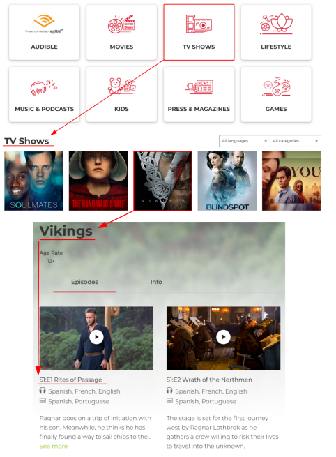

# -BackendTest

We need to define an API for our media platform, which allows us to display contents
following a hierarchical structure.
A Content can contain files (such as videos, pdfs, or text), a set of arbitrary metadata
associated with the content (content descriptions, authors, genre, etc.) and a rating
value which is a decimal number between 0 and 10.
See the following example of a Content, corresponding to an episode of a TV series.

    

We organize the contents in the platform through the use of Channels. A Channel
stores the hierarchical structure and has a title, a language, and a picture. A channel
can contain references to either other channels or contents. If a channel has
subchannels, it cannot have any content underneath, conversely, if a channel has
contents, it cannot have any subchannel underneath. A channel must have at least
one content or one subchannel.

In the following images, you can see an example of the channels that could be provided
by your API.

    

The rating of a channel is the average of the ratings of all the channels underneath, if
the channel has no subchannels its rating is the average of the ratings of its contents. If
a channel has no contents, it does not affect the ratings of its parent since its value is
undefined.
Channels can’t store this rating directly (because the structure can change at any time), so we need a way to compute it from the content structure behind them.

# Requirements

The requirements we ask for this test are:
● Create a Django project to define an API
● Define models to represent the structure explained above
● Create a management command to efficiently calculate the ratings of every
channel and export them in a csv file sorted by rating (i.e. the highest rated
channels on top). The csv contains two columns: <channel title>, <average
rating>
● Create endpoints to retrieve the channels, their subchannels and its contents
● Add unit tests to test the channel rating algorithm
Get bonus points for:
● Adding Groups to the channels. Considering that each channel can belong to
multiple groups.
○ Allow filtering by group on Channels API.
Note: Take into account that any channel’s groups set should be included in its
parent’s group set
● High test coverage through unit tests
● Usage of docker to run the services
● Addition of type annotations (bonus for passing strict mypy type checks)
● Adding CI/CD (Gitlab CI is preferred, but you can use anything you want)
You can use any libraries, DBMS or tools you need to accomplish the task.
We encourage you to define a readme file with some explanations about your solution.

